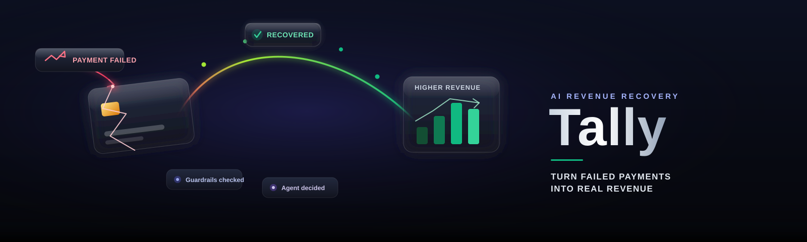
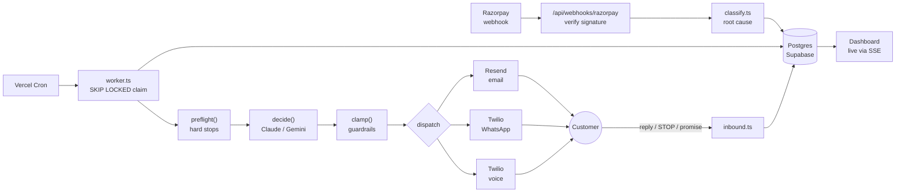
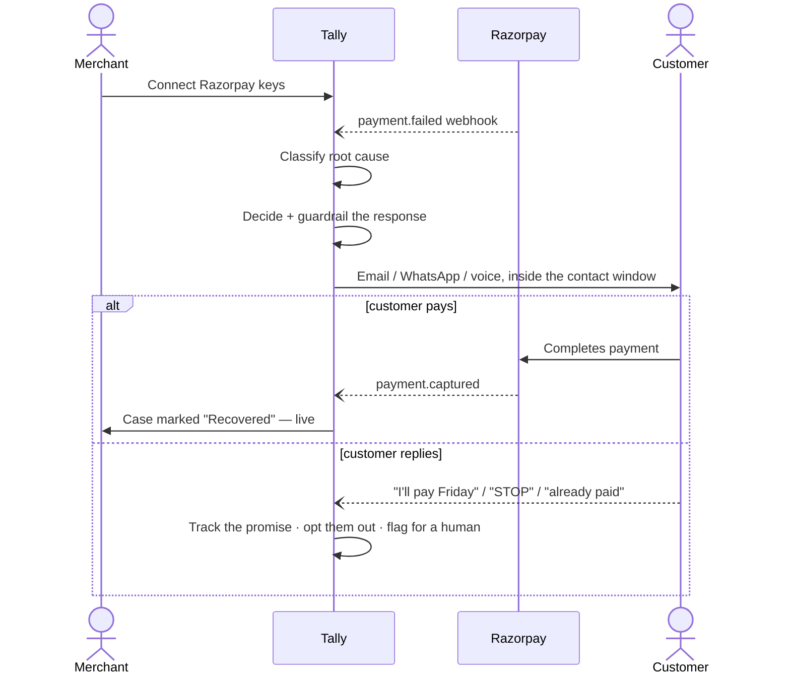
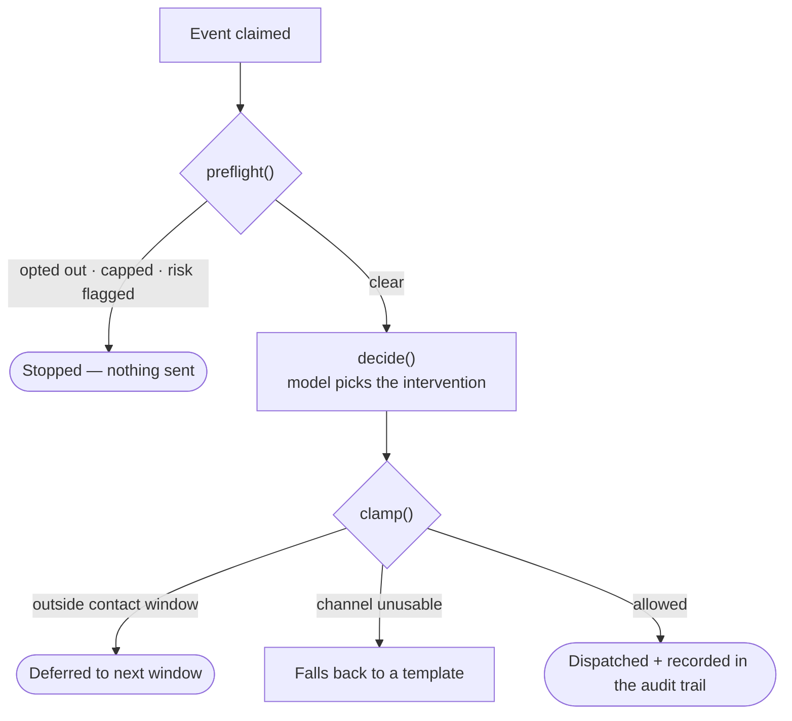
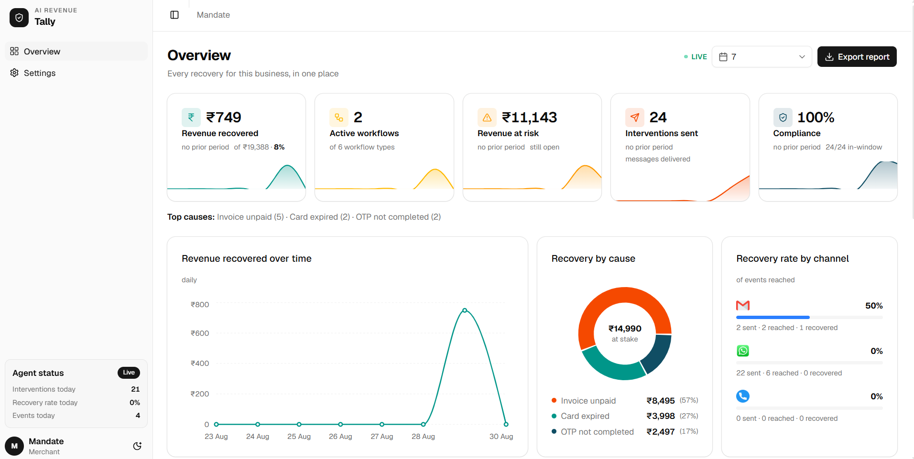
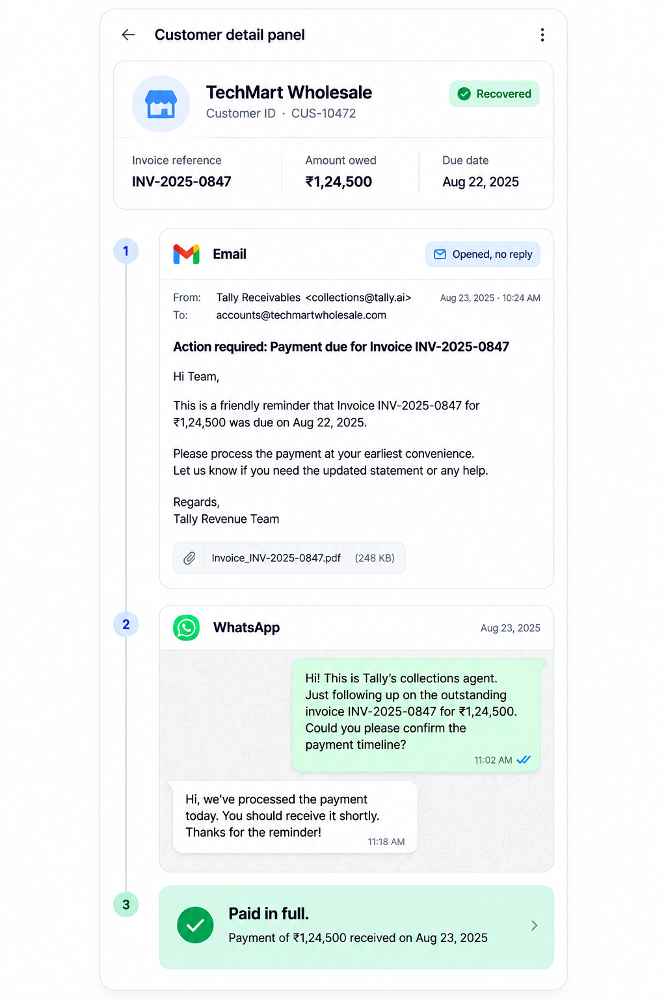

<div align="center">
  

  <br/><br/>

  
  
  
  
  
  
  

  <p></p>

  <strong>A failed Razorpay payment isn't one problem. Tally works out which one it is — then recovers it, on its own.</strong>
</div>

<br/>

<div align="center">

[What it does](#what-it-does) ·
[Architecture](#architecture) ·
[Journey](#merchant--customer-journey) ·
[Decision engine](#the-decision-engine) ·
[Dashboard](#dashboard) ·
[Tech stack](#tech-stack) ·
[Configuration](#configuration) ·
[Model backend](#the-model-backend) ·
[Quick start](#quick-start) ·
[Testing](#testing) ·
[Layout](#layout) ·
[Limitations](#known-limitations)

</div>

---

## What it does

| | |
|---|---|
| 🔌 **Connect once** | A merchant links their Razorpay keys through onboarding — encrypted, never touching `.env`. |
| 🔎 **Classify, don't guess** | Every failed payment is triaged into a root cause: expired card, insufficient funds, gateway timeout, OTP drop, risk flag. |
| 🤖 **Decide, then guardrail** | An LLM proposes the intervention; deterministic code enforces contact windows, attempt caps, and opt-outs — not the prompt. |
| 📨 **Recover across channels** | Email, WhatsApp, or a scripted voice call — whichever fits the cause and the customer. |
| 🏢 **Multi-tenant from commit one** | One engine, one database, one row per merchant. 300 merchants is 300 rows, not 300 deployments. |

---

## Architecture



*The agent proposes; the guardrails dispose. No prompt can talk Tally into messaging an opted-out customer, retrying a card that cannot work, or calling at 3am — those are decisions in code.*

---

## Merchant & customer journey



---

## The decision engine

Every root cause gets its own playbook, not a generic nudge:

| Cause | What Tally does |
|---|---|
| Insufficient funds | Waits for a likely salary-credit date (1st / 7th / 15th) instead of retrying tonight and failing again. |
| Expired or blocked card | Never retries. Asks for a different payment method. |
| Gateway timeout / bank down | Retries quietly and apologises — never implies the customer was declined. |
| OTP not completed | A fresh link, immediately, no explanation demanded. |
| International decline | Suggests a domestic card or UPI instead of a plain retry. |
| Risk / fraud flag | Stops automating. Escalates to a human. |



---

## Dashboard



| Section | Answers |
|---|---|
| **Overview** | Is the agent earning its keep? Money, trend, causes, workflow toggles. |
| **Customers** | Every case — status, channel, attempts — searchable, filterable, actionable. |
| **Case detail** | The whole conversation, channel-native: email thread, WhatsApp bubbles, call summary, admin actions. |
| **Settings** | Contact window, channels, attempt cap, pause switch, webhook URL. |



---

## Tech stack

| Layer | Choice |
|---|---|
| Framework | Next.js 15 (App Router) · React 19 · TypeScript |
| Database | Supabase Postgres — `FOR UPDATE SKIP LOCKED` claiming, row-level security |
| AI | Claude (Anthropic) or Gemini, behind one interface, Zod-validated output |
| Channels | Resend (email) · Twilio (WhatsApp + voice) |
| UI | Tailwind CSS 4 · shadcn / base-ui · Recharts |
| Payments | Razorpay SDK · per-merchant AES-256-GCM encrypted credentials |

---

## Configuration

| Kind | Lives in | Notes |
|---|---|---|
| Platform-level | `.env` | What Tally itself needs to run — see `.env.example`. |
| Per-merchant | Onboarding UI → `merchants` row | Razorpay keys, WhatsApp number, contact prefs. AES-256-GCM, bound to their own column — a ciphertext can't be moved from `key_id` onto `key_secret` and still decrypt. Never in `.env`, never shared. |

Nothing reads the environment at import time — a missing variable fails loudly and specifically, only when the feature that needs it runs.

---

## The model backend

```env
TALLY_LLM_PROVIDER=gemini      # or "anthropic"; defaults to whichever key is set
GEMINI_API_KEY=...             # GEMINI_MODEL defaults to gemini-3.5-flash
ANTHROPIC_API_KEY=...          # ANTHROPIC_MODEL defaults to claude-opus-5
```

Every response is Zod-validated before it reaches the guardrails. Transient upstream failures retry with backoff; an unreachable or unconfigured provider falls back to root-cause-keyed templates — recovery keeps working, it just stops being clever.

| Learned the hard way | |
|---|---|
| Gemini Pro tiers 429 on free keys; `-latest` aliases 503 under load | `gemini-3.5-flash` is the reliable default |
| `@anthropic-ai/sdk` 0.71.x structured output | Lives in the top-level `output_format`, **not** `output_config.format` |
| `betaZodOutputFormat` calls `z.toJSONSchema` | Zod 4 only — the SDK's peer range claiming 3.25 works is wrong |

---

## Quick start

```bash
npm install
cp .env.example .env          # fill in what you have
npm run stack:up              # local Postgres + PostgREST in Docker
npm run dev
```

Open `/docs` for the setup guide, `/onboarding` to connect a business. Against a real Supabase project instead of the local stack:

```bash
npm run db:push                # applies supabase/schema.sql
npm run dev
```

---

## Testing

| Command | Covers |
|---|---|
| `npm test` | 240 unit tests — crypto, classification, guardrails, agent wiring, channels |
| `npm run stack:up` && `npm run test:db` | Integration tests against real Postgres + PostgREST |
| `npm run batch -- --dry-run` | A full batch run with invariant checks queried straight from Postgres |

Three things a mock can't prove, tested against the real thing:

- **No double-claiming** — 200 events, 8 concurrent workers, every event claimed exactly once (mutation-checked: remove the recheck in `claim_events` and the test fails).
- **Idempotency** — eight parallel deliveries of one webhook produce one event and one customer.
- **Tenant isolation** — two merchants processed concurrently, nothing crosses the boundary.

---

## Layout

```
supabase/schema.sql        tables, the SKIP LOCKED claim, ingestion, aggregation
src/lib/
  crypto.ts                AES-256-GCM credential encryption, signature checks
  classify.ts              Razorpay failure -> root cause, and what fixes it
  merchants.ts             onboarding; the only module that touches credentials
  agent/
    rules.ts               guardrails: windows, caps, scheduling, the clamp
    decide.ts              decision + template fallback
    providers/              Claude and Gemini behind one interface
    worker.ts               claim -> decide -> act -> record
  channels/                email (Resend), whatsapp + voice (Twilio)
src/components/            dashboard UI: charts, filters, tables, forms
src/app/
  (marketing)/             landing, docs, onboarding
  dashboard/[slug]/        the merchant dashboard, its own sidebar
  api/                     onboarding, settings, webhooks, the cron tick
scripts/                   local stack, schema push, seed, worker, batch run
```

---

## Known limitations

| Limitation | Detail |
|---|---|
| Voice needs `TWILIO_PHONE_NUMBER` | Unconfigured, the channel reports itself unusable and the agent escalates elsewhere. |
| WhatsApp uses the Twilio Sandbox | Recipients must join the sandbox first — not yet a merchant's own WhatsApp Business sender. |
| Voice is scripted text-to-speech | Not a back-and-forth conversation. |
| Contact window assumes a stable UTC offset | Exact for `Asia/Kolkata`; can drift an hour on a DST transition night elsewhere. |
| Cross-worker coordination is time-bounded | A six-hour recent-contact check, not a per-customer lock. |

---

<div align="center">
  <sub>Built for Razorpay merchants who'd rather the money just came back on its own.</sub>
</div>
