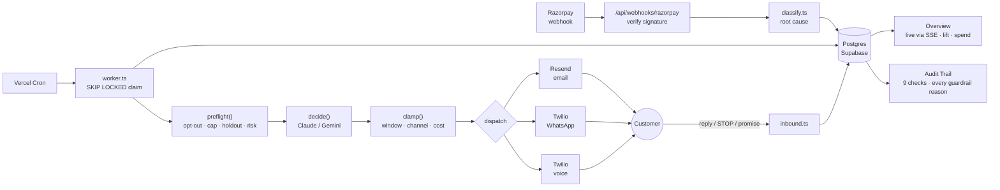
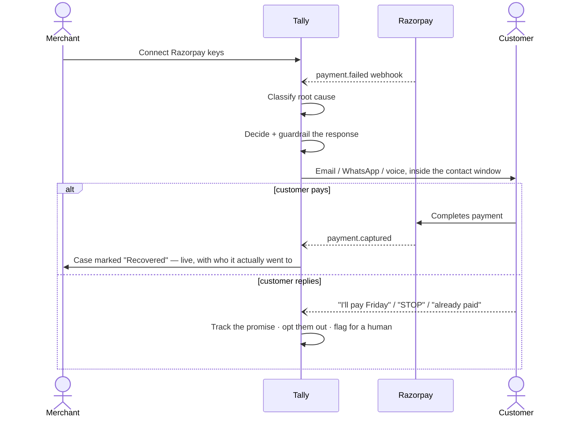
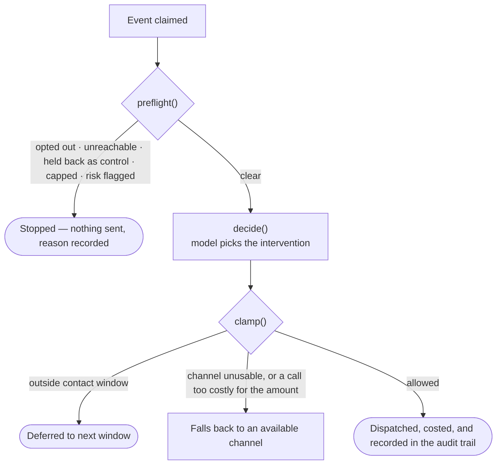

<div align="center">
  

  <br/><br/>

  
  
  
  
  
  
  
  

  <p></p>

  <strong>A failed Razorpay payment isn't one problem. Tally works out which one it is, recovers it on its own, and can prove afterwards that it worked.</strong>
</div>

---

## What it does

| | |
|---|---|
| 🔌 **Connect once** | A merchant links their Razorpay keys through onboarding — encrypted, never touching `.env`. |
| 🔎 **Classify, don't guess** | Every failed payment is triaged into a root cause: expired card, insufficient funds, gateway timeout, OTP drop, risk flag. |
| 🤖 **Decide, then guardrail** | An LLM proposes the intervention; deterministic code enforces contact windows, attempt caps, and opt-outs — not the prompt. |
| 📨 **Recover across channels** | Email, WhatsApp, or a scripted voice call — whichever fits the cause, the customer, and what the amount actually justifies. |
| 📊 **Prove it, don't just claim it** | A held-back control group, a real cost per message, and every guardrail re-checked live against the rows — not the worker's own word for it. |
| 🏢 **Multi-tenant from commit one** | One engine, one database, one row per merchant. 300 merchants is 300 rows, not 300 deployments. |

---

## Architecture



*The agent proposes; the guardrails dispose. No prompt can talk Tally into messaging an opted-out customer, retrying a card that cannot work, calling at 3am, or phoning someone over a ninety-rupee failure — those are decisions in code, and the Audit Trail page re-runs the checks against Postgres itself rather than trusting the worker's own report of its evening.*

---

## Merchant & customer journey



Every step above is also drawn — animated, in the merchant's own browser — on the public marketing site's own "How it works" section (`src/components/marketing/how-it-works-diagram.tsx`), traced from this same worker rather than simplified for the page. Open a case on the dashboard and the same sequence renders again as a numbered, live-updating strip: *claimed → safety checks passed → attempt 1 → sent → waiting → recovered*, so a merchant watching their own test failure sees precisely what this diagram describes, happening.

---

## The decision engine

Every root cause gets its own playbook, not a generic nudge:

| Cause | What Tally does |
|---|---|
| Insufficient funds | Waits for a likely salary-credit date (1st / 7th / 15th) instead of retrying tonight and failing again. |
| Expired or blocked card | Never retries. Asks for a different payment method. |
| Gateway timeout / bank down | Retries quietly and apologises — never implies the customer was declined. |
| OTP not completed | A fresh link, immediately, no explanation demanded. |
| International decline | Suggests a domestic card or UPI instead of a plain retry. |
| Risk / fraud flag | Stops automating. Escalates to a human. |



Seven checks happen before the model is ever called, and their order is deliberate: the held-back control check sits *after* opt-out and reachability, because a customer who could never have been contacted anyway is not a control — it would credit the agent with a recovery it was never in a position to influence. A batch run verifies the guardrails' actual behaviour against Postgres afterwards, not just that preflight has these branches (see [Testing](#testing)).

---

## Measuring what it's worth

A dashboard that only ever reports what the agent *did* cannot answer the two questions that come right after: **did any of that actually work, and did it stay inside the lines while doing it?** Three things exist to answer those honestly — none of them assumed, all of them queried straight out of Postgres.

### A held-back control group

Set a holdout percentage per merchant, and that share of their customers is **never contacted**, deterministically:

```sql
-- ingest_event, on every new failure
(hashtext(customer_id::text)::bigint & 2147483647) % 100 < holdout_percent
```

Hashed on the **customer**, not the event — a person chased for one failure and left alone for the next would contaminate both arms. The case is still watched for payment, so "held back" is measured against, not simply dropped. The dashboard's Overview page compares the two arms directly:

> Contacted: 34% recovered · Control: 11% recovered · **+23 points, and it says so only once the control arm has at least 30 cases** — below that, it states plainly that there is nothing to compare yet, rather than quoting a lift computed from four events.

### What it cost to get that money back

Every send is costed against a rate card (`src/lib/costs.ts`) and recorded on the action row at the moment it goes out — not recomputed later from a table that may have changed:

| Channel | ~Cost | |
|---|---|---|
| Email | ₹0.03 | effectively free, still counted so the total isn't silently missing a channel |
| WhatsApp | ₹0.65 | |
| Voice | ₹1.20/attempt | ~40× a WhatsApp message, and the most intrusive thing this system can do |

That price difference *is* a guardrail: a voice call is never offered for a failure under ₹500 (`voiceIsProportionate()`), enforced as channel availability rather than left to the model's judgement — "would you phone someone over ninety rupees" isn't a call worth delegating.

### Every guardrail, re-checked against the rows

`npm run batch` seeds a realistic week, drives the real worker over it, then asks Postgres directly whether every rule actually held — deliberately not trusting the worker's own report, because a worker reporting a clean run is exactly what a bug in the worker would also produce:

<table>
<tr><td>

No event over its attempt cap
No opted-out customer contacted *after* opting out
No retry scheduled for a cause that cannot succeed
Risk-flagged payments escalated, never messaged
No held-back customer ever contacted

</td><td>

Every processed case has an audit trail
Every action records its own reasoning
No action filed under the wrong merchant
No event points at another merchant's customer
Nothing sent outside the contact window

</td></tr>
</table>

Nine of the same checks are also live on the dashboard's **Audit Trail** tab, scoped to real merchant data instead of a seeded batch — so "did it behave" is answerable from a running business, not only from a test script. The other three only make sense against a batch: firing the same webhook 25 times, and checking a tenant boundary from the customer's side as well as the merchant's, are things to verify once in CI, not run against live traffic on every page load.

---

## Dashboard


| Section | Answers |
|---|---|
| **Overview** | Is the agent earning its keep? Money, trend, causes, the held-back control group vs. what got contacted, and what the chasing cost. |
| **Inbox** | Every case waiting on a person, ranked by what's at stake — the triage view, not the full table. |
| **Customers** | Every case — status, channel, attempts — searchable, filterable, actionable, with recovery, automation, and guardrail-share tiles up top. |
| **Case detail** | The whole conversation, channel-native: email thread, WhatsApp bubbles, call summary, admin actions — headed by a numbered **Live progress** strip that tracks the case from `FAILED` to `RECOVERED` in real time. |
| **Workflows** | The four recovery categories, toggled on or off, next to what each has actually recovered. |
| **Audit Trail** | Every action ever recorded, including deliberate inaction, filterable by customer and outcome — plus the 9 guardrail invariants checked live against this merchant's own rows. |
| **Settings** | Contact window, channels, attempt cap, holdout percentage, pause switch, webhook URL. |

---

## Tech stack

| Layer | Choice |
|---|---|
| Framework | Next.js 15 (App Router) · React 19 · TypeScript |
| Database | Supabase Postgres — `FOR UPDATE SKIP LOCKED` claiming, row-level security |
| AI | Claude (Anthropic) or Gemini, behind one interface, Zod-validated output |
| Channels | Resend (email) · Twilio (WhatsApp + voice) |
| UI | Tailwind CSS 4 · shadcn / base-ui · Recharts |
| Payments | Razorpay SDK · per-merchant AES-256-GCM encrypted credentials |

---

## Configuration

| Kind | Lives in | Notes |
|---|---|---|
| Platform-level | `.env` | What Tally itself needs to run — see `.env.example`. |
| Per-merchant | Onboarding UI → `merchants` row | Razorpay keys, WhatsApp number, contact prefs, holdout percentage. AES-256-GCM, bound to their own column — a ciphertext can't be moved from `key_id` onto `key_secret` and still decrypt. Never in `.env`, never shared. |

Nothing reads the environment at import time — a missing variable fails loudly and specifically, only when the feature that needs it runs.

---

## The model backend

```env
TALLY_LLM_PROVIDER=gemini      # or "anthropic"; defaults to whichever key is set
GEMINI_API_KEY=...             # GEMINI_MODEL defaults to gemini-3.5-flash
ANTHROPIC_API_KEY=...          # ANTHROPIC_MODEL defaults to claude-opus-5
```

Every response is Zod-validated before it reaches the guardrails. Transient upstream failures retry with backoff; an unreachable or unconfigured provider falls back to root-cause-keyed templates — recovery keeps working, it just stops being clever.

| Learned the hard way | |
|---|---|
| Gemini Pro tiers 429 on free keys; `-latest` aliases 503 under load | `gemini-3.5-flash` is the reliable default |
| `@anthropic-ai/sdk` 0.71.x structured output | Lives in the top-level `output_format`, **not** `output_config.format` |
| `betaZodOutputFormat` calls `z.toJSONSchema` | Zod 4 only — the SDK's peer range claiming 3.25 works is wrong |

---

## Quick start

```bash
npm install
cp .env.example .env          # fill in what you have
npm run stack:up              # local Postgres + PostgREST in Docker
npm run dev
```

Open `/docs` for the setup guide, `/onboarding` to connect a business. Against a real Supabase project instead of the local stack:

```bash
npm run db:push                # applies supabase/schema.sql
npm run dev
```

---

## Testing

| Command | Covers |
|---|---|
| `npm test` | 409 unit tests — crypto, classification, guardrails, agent wiring, channels, cost model, the holdout arm, the live-progress derivation, the lift and invariant refusals |
| `npm run stack:up` && `npm run test:db` | Integration tests against real Postgres + PostgREST |
| `npm run batch -- --dry-run --advance-hours=12` | A full batch run, with the clock stepped forward so the entire retry ladder plays out in seconds, checked against 12 invariants queried straight from Postgres |
| `npm run clean:batch -- --dry-run` | Lists (and, without the flag, deletes) everything a batch run seeded, so a demo dashboard doesn't stay buried under synthetic data |

Five things a mock can't prove, tested against the real thing:

- **No double-claiming** — 200 events, 8 concurrent workers, every event claimed exactly once (mutation-checked: remove the recheck in `claim_events` and the test fails).
- **Idempotency at the database** — 8 concurrent deliveries of one webhook produce exactly one event and one customer (`test:db`).
- **Idempotency through the whole pipeline** — the batch script delivers the same webhook 25 times at once and asserts one case, and at most one message actually sent to the customer.
- **Tenant isolation** — two merchants processed concurrently, nothing crosses the boundary.
- **The control arm stays clean** — held-back customers are asserted, after a full batch run, to have received nothing at all.

---

## Layout

```
supabase/schema.sql        tables, the SKIP LOCKED claim, ingestion, aggregation, holdout assignment
src/lib/
  crypto.ts                AES-256-GCM credential encryption, signature checks
  classify.ts              Razorpay failure -> root cause, and what fixes it
  costs.ts                 the rate card, and the voice-proportionality guardrail
  evidence.ts              lift, spend, and 9 of the guardrail invariants, queried live
  journey.ts               one case's whole life, as numbered steps
  merchants.ts             onboarding; the only module that touches credentials
  agent/
    rules.ts               guardrails: windows, caps, holdout, scheduling, the clamp
    decide.ts               decision + template fallback
    providers/              Claude and Gemini behind one interface
    worker.ts               claim -> decide -> act -> record, on an injectable clock
  channels/                email (Resend), whatsapp + voice (Twilio)
src/components/
  marketing/               the public site's animated architecture diagram, bento features
  case-journey.tsx         the dashboard's live progress strip
  audit-trail.tsx          the Audit Trail tab - the actions log, plus the 9 guardrail checks
src/app/
  (marketing)/             landing, docs, onboarding
  dashboard/[slug]/        the merchant dashboard, its own sidebar
  api/                     onboarding, settings, webhooks, the cron tick
scripts/
  batch-test.ts            seed a week, drive the worker, verify 12 invariants live
  clean-batch.ts           remove exactly what a batch run seeded, nothing else
```

---

## Known limitations

| Limitation | Detail |
|---|---|
| Voice needs `TWILIO_PHONE_NUMBER` | Unconfigured, the channel reports itself unusable and the agent escalates elsewhere. |
| WhatsApp uses the Twilio Sandbox | Recipients must join the sandbox first — not yet a merchant's own WhatsApp Business sender. |
| Voice is scripted text-to-speech | Not a back-and-forth conversation. |
| Contact window assumes a stable UTC offset | Exact for `Asia/Kolkata`; can drift an hour on a DST transition night elsewhere. |
| Cross-worker coordination is time-bounded | A six-hour recent-contact check, not a per-customer lock. |
| A holdout under ~30 cases isn't a result | The machinery computes a real lift at any size; the Overview page says so rather than letting a four-event sample be read as a percentage that means something. |

---

<div align="center">
  <sub>Built for Razorpay merchants who'd rather the money just came back on its own — and want to see the receipts.</sub>
</div>
